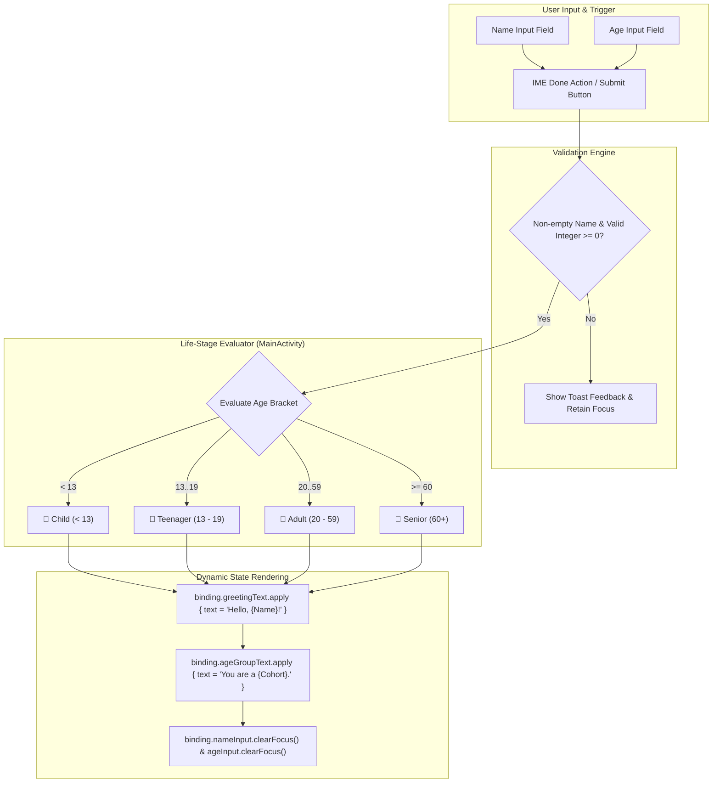

# 🧬 Genwise — Generational Life-Stage & Demographic Intelligence

[](https://developer.android.com)
[](https://kotlinlang.org/)
[](https://material.io/develop/android)
[](https://developer.android.com/about/versions/15)
[](LICENSE)

> **Genwise** is an Android demographic classification and life-stage intelligence application designed to deliver real-time generational cohort evaluation through clean UI states, ViewBinding, and Material 3 design.

---

## 📖 Overview

Categorizing demographic data and understanding human generational life stages is fundamental across personalized UX onboarding, health assessments, and educational profiling.

**Genwise** provides a lightweight, responsive native Android implementation for evaluating age-based cohort criteria. Featuring **ViewBinding**, custom stroke input styling, and integrated IME keyboard action listeners, the app validates inputs, evaluates life-stage bounds, and dynamically renders personalized greetings and cohort classifications.

---

## 🏗️ Architecture & Classification Flow



---

## ✨ Core Features

- 🎯 **Accurate Life-Stage Classification**: Multi-tier evaluation logic parsing input into distinct biological and social cohorts: `Child`, `Teenager`, `Adult`, and `Senior`.
- ⚡ **Seamless IME Done Action**: Directly trigger classification from the soft keyboard's `IME_ACTION_DONE` key for frictionless single-handed operation.
- 🛡️ **Robust Input Sanitization**: Form validation guarding against non-numeric entries, empty text buffers, and negative values with instant Toast diagnostics.
- 🎨 **Material 3 Design System**: Styled text input layouts with custom color states, focus strokes, and dynamic visibility transitions.
- 🧩 **ViewBinding Architecture**: Complete elimination of `findViewById` boilerplate for type-safe, null-safe view references.

---

## 📱 Demographic Taxonomy

| Cohort Category | Age Span | Clinical & Demographic Description |
|---|---|---|
| **👶 Child** | `< 13` years | Early developmental stage focusing on pediatric growth and foundational learning |
| **🎒 Teenager** | `13 – 19` years | Adolescent transition characterized by rapid cognitive and physical maturation |
| **💼 Adult** | `20 – 59` years | Prime working age cohort involved in professional, family, and civic life |
| **🧓 Senior** | `60+` years | Elder life-stage with focus on healthy longevity, retirement, and legacy |

---

## 🛠️ Technology Stack

| Layer / Component | Technology | Version | Purpose |
|---|---|---|---|
| **Platform** | Android | API 24 – 35 | Native Android runtime |
| **Language** | Kotlin | `2.0+` | Clean, concise application logic |
| **UI Framework** | ViewBinding + ConstraintLayout | `2.1.4` | Responsive constraint-based view hierarchy |
| **Design System** | Google Material Components | `1.12.0` | Material 3 themes and surface styling |
| **Build System** | Gradle (Kotlin DSL) | AGP `8.x` | Modern build automation |

---

## 🚀 Getting Started

### Prerequisites

- **Android Studio Ladybug** or newer.
- **JDK 11 or JDK 17**.
- **Android SDK 35**.

### Build & Run

1. Clone the repository:
   ```bash
   git clone https://github.com/shayann07/Genwise.git
   cd Genwise
   ```
2. Open in Android Studio and sync Gradle.
3. Build the debug APK:
   ```bash
   ./gradlew assembleDebug
   ```
4. Run on an Android emulator or physical device.

---

## 📄 License

This project is licensed under the [MIT License](LICENSE) — Copyright (c) 2026 [shayann07](https://github.com/shayann07).
